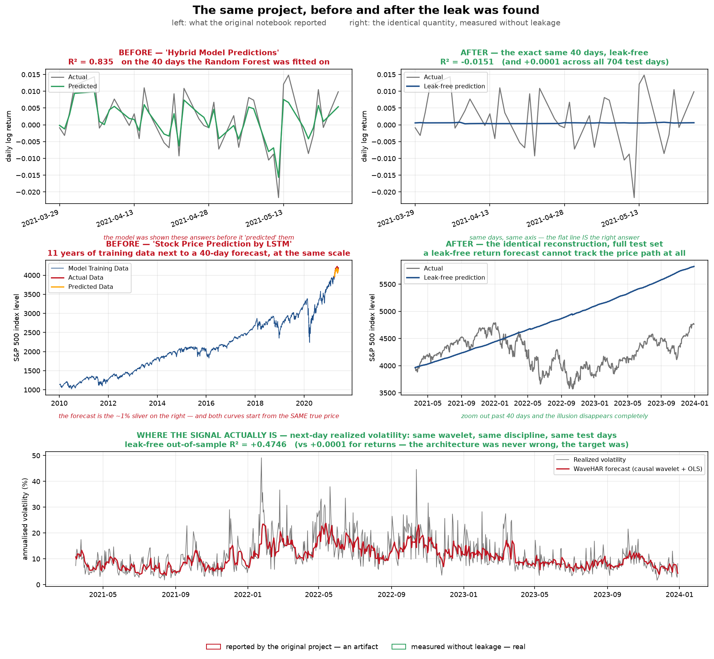

# S&P 500 Forecasting: An Autopsy of a Leaky Model, and What It Took to Fix It

**Ahmet Kaçmaz**

A hybrid **ARFIMA + Wavelet** pipeline for S&P 500 volatility, built in four acts: a forensic
teardown of my own leaky first version; an honest rebuild that showed which components actually
work; a redesign in which the wavelet finally earns a real role; and a **stress test that attacks my
own best result** — and partly breaks it.



*The two charts on the left are the ones the original project published. The two on the right are
the identical quantities, measured without leakage. The bottom panel is where the signal actually
turned out to be.*

---

## TL;DR

I built the standard wavelet-hybrid forecasting pipeline for daily S&P 500 log returns. It reported
an out-of-sample **R² of 0.83** and **90% directional accuracy**.

Those numbers were an artifact of **data leakage**. I can prove it: if I replace every LSTM output
in the model with **pure random noise**, the pipeline still reports R² ≈ 0.82. The forecasting model
was contributing nothing. A Random Forest was being fitted to its own test labels.

This repository contains the autopsy and the rebuild.

| | naive pipeline | leak-free rebuild |
|---|---|---|
| reported R² (daily returns) | **0.832** | **−0.027** |
| directional accuracy | 97% | 50.6% |
| test days actually evaluated | 40 of 705 | **705 of 705** |
| reproducible with random noise | **yes** | no |
| distinguishable from forecasting zero | — | no (DM test, *p* = 0.27) |

The honest answer for daily returns is **there is no signal**. So I asked where the architecture
*does* belong — and rebuilt it for **realized volatility**, where long memory and multi-scale
structure are real:

| model | out-of-sample R² (log realized vol) |
|---|---|
| **ARFIMA alone** | **0.4732** |
| ARFIMA + Wavelet + LSTM | 0.4711 ± 0.0017 *(5 seeds)* |
| HAR-RV (field standard) | 0.4631 |
| GARCH(1,1) | 0.3502 |
| EWMA / RiskMetrics | 0.3448 |
| Random walk | 0.2144 |

Volatility *is* forecastable. Volatility-targeted exposure also cuts realised volatility and drawdown
— though **Part 5 later retracts** the Sharpe-improvement claim as statistically unsupported on a
2.8-year test sample.

But the honest headline is the uncomfortable one: **the deep-learning stack adds nothing over a
properly specified ARFIMA.** It is in fact *marginally worse*, by a gap of 1.2 standard deviations of
the model's own random-seed noise — i.e. indistinguishable (Diebold–Mariano *p* = 0.19). The
long-memory term does all the work; the five LSTMs and the stacked forest are decoration.

This is the discipline that Part 1 is about. On a **single lucky seed** the hybrid scored 0.4736 and
I would have reported beating the ARFIMA. Averaging over five seeds is what caught it. The notebooks
therefore **print their own conclusions from the computed results** rather than relying on numbers
typed into the markdown — that is how a write-up quietly starts lying about itself.

So is the wavelet just dead weight? No — and that question became Part 3.

**Part 3 rebuilds the wavelet component the way the forecasting literature actually recommends**
(causal Haar à trous transform; Renaud–Starck–Murtagh) and gives it a job worthy of it: not fodder
for LSTMs, but a **derived multiscale basis** challenging HAR-RV's hand-picked 1/5/22-day scales,
with the same OLS estimator on both sides. It reported WaveHAR beating HAR-RV (R² 0.475 vs 0.463,
DM **p = 0.026**), with the margin growing to **p = 0.004 at h = 22** and a higher R² in **6 of 6
markets**.

**Part 4 then tries to destroy that result — and partly succeeds.**

Audrino & Chassot (2024), testing ML models against HAR on 1,455 stocks, showed that most "we beat
HAR" claims are really beating a *carelessly fitted* HAR: the training window and re-estimation
frequency matter more than the model. In Part 3 my HAR was estimated **once** and frozen for three
years — exactly the scheme they criticise. So Part 4 rebuilds every benchmark at full strength:
a rolling/expanding **fitting-scheme grid** (chosen on a validation window *inside* the training
period, never on test), a **rolling-refitted ARFIMA**, and **modern HAR extensions** with leverage
and jump components.

The verdict is split, and I report both halves:

| claim | verdict under the stress test |
|---|---|
| WaveHAR > HAR at **h = 1** | ❌ **broken** — p = 0.026 → **p = 0.133** once HAR is rolling-refitted |
| WaveHAR > HAR at **h = 22** | ✅ **survives** — p = 0.004 → **p = 0.002**, exactly where multiscale theory predicts |
| wavelet basis with predictors matched (WaveHAR-LJ vs HAR-LJ) | ⚠️ ahead in **5 of 6 markets** and by +0.034 R² at h=22, but **not statistically significant** (p = 0.068) |
| **biggest single gain in the whole project** | **leverage + jump predictors: +0.027 R²** — bigger than anything the wavelet or the fitting scheme contributed |

So the honest final position is narrower than Part 3's: **the wavelet's advantage is real but
horizon-dependent** — it holds at the monthly horizon, where separating persistent from transient
scales genuinely matters, and dissolves at the daily horizon once the benchmark is fitted properly.

And the punchline of the whole project arrives here: the largest improvement came not from the
wavelet, not from the LSTM, and not from the fitting scheme, but from **adding two predictors the
volatility literature has known about for twenty years.** Domain knowledge beat representation
engineering, again.

**Part 5 then asks the question four notebooks of engineering never could: how much of my
architecture survives contact with a free ticker download?**

Every model in Parts 1–4 shares one blind spot: **they all look backwards.** HAR extrapolates from
the last 1/5/22 days, ARFIMA from a long-memory filter, the wavelet decomposes the past into scales.
None of them can know that the Fed meets on Wednesday. **The options market can.** VIX is the S&P
500's implied volatility over the next 30 days, priced by traders with money at stake — forward-looking
by construction.

| result (h = 1, S&P 500) | R² |
|---|---|
| HAR (2009, 3 features) | 0.457 |
| HAR + leverage + jumps | 0.476 |
| **WaveHAR-LJ — four notebooks of architecture** | **0.500** |
| **`IV alone` — five features off a free ticker** | **0.512** |
| HAR-LJ + implied vol | 0.537 |
| WaveHAR-LJ + implied vol | **0.542** |

Adding implied volatility is worth **+0.061 R² (DM p < 0.0001)** — a bigger, more significant gain
than the wavelet, the LSTM stack and the fitting-scheme grid *combined*. And a five-feature linear
regression on VIX alone is **statistically indistinguishable from my entire architecture** (p = 0.36).

Worse: once implied volatility is in the model, **the wavelet's contribution is no longer detectable**
— in 0 of 3 markets. The wavelet and the HAR lags summarise *the same past* in different ways; the
options market has information that **is not in the past at all**.

The one place structure still wins is the **long horizon**: implied vol is a 30-day forward measure,
so its edge concentrates at short horizons, while at h = 22 the persistent multiscale structure of
realized volatility reasserts itself and WaveHAR-LJ is still the best model.

**Part 5 also corrects Part 2.** Re-examining the volatility-targeting backtest: the standard error
on a Sharpe ratio over 2.8 years is ≈ **0.6**, and a block-bootstrap CI on the improvement spans zero.
Volatility targeting genuinely cuts volatility and drawdown — that part is mechanical — but **the
Sharpe improvement reported in Part 2 is not statistically supported**, and it is retracted here.

Across all five parts, one pattern: **complexity kept losing.** First to structure, then to
information.

> When a model is stuck, the reflex is to reach for a bigger model. Almost always the binding
> constraint is **information**, not capacity. Ask what your model *cannot possibly know* — and go
> get that, before you make it deeper.

---

## The bug

```python
def combine_predictions(self, approx_pred, detail_preds, y_true):
    X = np.column_stack([approx_pred] + detail_preds)
    self.rf_model.fit(X, y_true)      # trains on the answer key…
    return self.rf_model.predict(X)   # …then "predicts" the same rows
```

`predict()` calls this with the **test set's true values** as `y_true`. The model is shown the
answers, memorises them with a 100-tree forest, and hands them back as a forecast.

Three more bugs compounded it:

1. **Only 5.7% of the test set was evaluated.** `pywt.wavedec` downsamples; after the level-4
   decomposition and length-truncation, 705 test days became **40 predictions**. The `37/39` in the
   original's directional-accuracy printout was the tell.
2. **Inputs came from the target's future.** The code used the wavelet *coefficient index* as if it
   were a *day index*. At level 4 each coefficient spans ~16 days, so the model was fed data from up
   to **735 days after** the day it was asked to predict.
3. **There was no ARFIMA.** The model was named for a long-memory component it never had.
   `auto_arima` selected ARIMA(2,0,0) — `d = 0` — and no fractional differencing appears anywhere in
   the code. It was an AR(2). *Correctly so*: on returns the fractional differencing parameter is
   d ≈ 0, so there was no long memory to capture.

That last point turned out to be the key to the whole project.

---

## Notebooks

### [`01_leakage_forensics.ipynb`](nb/01_leakage_forensics.ipynb)
Reproduces the naive pipeline and its R² = 0.83, then dismantles it:
- the **random-noise ablation** that proves the model contributes nothing to its own result
- an empirical measurement of the wavelet transform's support, showing the look-ahead
- a **leak-free rebuild** — causal wavelet features recomputed on trailing windows only, a stacker
  trained on out-of-fold predictions, the full test set — with a **causality unit test** that
  destroys the future and asserts the past does not move
- the honest result (R² ≈ 0) against zero-forecast, historical-mean, random-walk and AR(2) baselines,
  with a Diebold–Mariano test

### [`02_volatility_model.ipynb`](nb/02_volatility_model.ipynb)
Points the same architecture at the target it was always suited for:
- **why**: the fractional differencing parameter is d ≈ **−0.13** for returns but **+0.58** for log
  realized volatility — long memory is a property of volatility, not returns
- a **real ARFIMA**, with an actual fractional-difference filter (the binomial expansion of
  $(1-L)^d$), verified to remove the long memory it targets
- the same causal wavelet + LSTM + stacker machinery, evaluated against **HAR-RV, GARCH(1,1), EWMA**
  and a random walk, on RMSE, R² and QLIKE
- a **volatility-targeting backtest** net of transaction costs — with a constant-forecast control
  strategy that isolates how much of the improvement is timing rather than leverage

### [`03_multiscale_extensions.ipynb`](nb/03_multiscale_extensions.ipynb)
Gives the wavelet the job it should have had from the start:
- the **causal Haar à trous transform** — shift-invariant, causal *by construction* (each smoothing
  step averages the present with a point strictly in the past), O(T·J), exact additive
  reconstruction; both properties are unit-tested, not asserted
- **WaveHAR**: six derived multiscale components vs HAR-RV's three hand-picked averages, same OLS
  estimator on both sides, plus a **flexibility-matched control** (a 6-feature extended HAR) so a
  win cannot be bought with extra parameters
- **multi-horizon forecasts** (h = 1…22 days) with **HAC Diebold–Mariano tests** (Newey–West
  variance, Harvey small-sample correction — required for overlapping multi-day targets)
- a **hand-rolled multi-step ARFIMA** (forecast the fractionally differenced series, invert
  $(1-L)^d$ step by step) validated against `statsmodels` to ~1e-16 before use
- **six markets**, one pipeline, nothing re-tuned; per-regime diagnostics; one more (failed) attempt
  to make nonlinearity pay, this time with a cross-scale forest

### [`04_stress_test.ipynb`](nb/04_stress_test.ipynb)
Attacks the Part 3 result with the strongest benchmarks I can build:
- a **fitting-scheme grid** (expanding + rolling 500/1000/1500/2000 days × refit every 1/5/22 days),
  because *HARd to Beat* showed the fitting scheme is what most "we beat HAR" papers get wrong
- **the scheme is selected on a validation window inside the training period** — picking the scheme
  that happens to look best on test would be the same class of error as Part 1's leak
- **modern HAR extensions**: leverage ($\min(r_t,0)$) and jump (overnight gap) components, added to
  *both* representations so the basis is compared like-for-like
- a **rolling-refitted ARFIMA** with the MA innovation carried through the full recursion — the
  benchmark is meant to be as strong as I can make it, not conveniently weak
- the outcome: **Part 3's h=1 claim dies; its h=22 claim survives.** Reported as such, and it
  supersedes Part 3's headline.

### [`05_implied_volatility.ipynb`](nb/05_implied_volatility.ipynb)
Gives the model the one thing no amount of architecture could provide — **forward-looking information**:
- the **VIX suite**: implied vol, its 5-day mean, the **term-structure slope** (VIX3M − VIX, which
  *inverts* in a crisis), **VVIX** (vol-of-vol), and the **variance risk premium**
- the fitting scheme **and the Ridge penalty** are selected per model *and per horizon* on validation —
  a prototype that fixed the window across horizons nearly produced the false conclusion "implied vol
  hurts at long horizons"; it does not, the window was just too short for overlapping monthly targets
- three horizons (h = 1, 5, 22), HAC Diebold–Mariano, and three markets with their own IV indices
  (VIX, VXN, VXD — the DAX/FTSE/Nikkei have no free equivalent, which is itself the point)
- **a correction to Part 2**: the Sharpe improvement from volatility targeting is re-tested with a
  paired block bootstrap and found **not statistically supported**. Retracted.

---

## Method: what "leak-free" means here

The rules enforced throughout the rebuild:

- **Nothing is `.fit()` inside `predict()`.** Ever.
- **No feature for day *t* may touch data from day *t*+1 or later.** The wavelet decomposition is
  recomputed each day on a trailing 256-day window rather than applied once to the whole series — and
  this is *tested*, not asserted: corrupt every future observation, recompute, and check that no past
  feature moves by more than 1e-10.
- **The stacker trains on out-of-fold predictions** from the training period, generated by
  `TimeSeriesSplit`. The same fold models produce the test features, so the stacker never meets a
  feature distribution it did not train on.
- **Every scaler, every model parameter, every calibration constant is fitted on the training period
  only** — including the Garman–Klass scale factor in the backtest.
- **The full test set is scored**, and every model is compared on identical days.
- **Baselines strong enough to lose to**, and a Diebold–Mariano test to say whether a margin is real.

---

## Reproducing

```bash
pip install -r requirements.txt
python scripts/fetch_data.py          # caches data/*.csv (6 indices; skips files already present)
jupyter lab nb/                       # all three notebooks run top-to-bottom
```

All three notebooks execute cleanly end-to-end (verified with `nbconvert --execute`, no
`--allow-errors`). Parts 1–2 train LSTMs and take ~20–30 minutes each on CPU; Part 3 is linear and
runs in a few minutes. Notebooks 1–2 are stochastic (TensorFlow), so their exact figures move a
little between runs — which is why their conclusions are printed from computed results; Part 3 is
fully deterministic. Data is cached to CSV rather than fetched inline, because `yfinance` now
returns MultiIndex columns and silently breaks older notebooks that index `df['Close']`.

---

## What I would not claim

**The volatility proxy is range-based, not high-frequency.** The literature's standard target is
realized variance from **5-minute intraday returns** (Liu, Patton & Sheppard, 2015). I use the
**Garman–Klass** estimator from daily OHLC bars, because intraday data for six indices over fourteen
years is not freely available. Range-based estimators are legitimate but **noisier**, and a noisier
target compresses the differences between good models. **This is the largest gap between this
project and the published literature, and it is not closed.**

For the same reason the leverage and jump components are **daily-data analogues**, not the canonical
HAR-J / SHAR / HARQ specifications, which need bipower variation, signed semivariances and realized
quarticity. They are what a daily-data practitioner would actually use — but they are not the real
thing, and I do not call them that.

Beyond that: six indices, one asset class, one out-of-sample window per market. The margins inside
the long-memory family are small and often not significant; the notebooks say which, next to each
number. The claim is **not** "WaveHAR dominates." It is: *a derived multiscale basis is a defensible
peer of the field-standard hand-crafted one, with a significant advantage at the monthly horizon
where its theory predicts one, and no detectable advantage at the daily horizon once the benchmark
is fitted properly.*

## The through-line

The first version of this project reported R² = 0.83 and 90% directional accuracy on daily returns.
Every digit was an artifact of a Random Forest fitted to its own test labels.

What replaced it reports smaller numbers on a target that is genuinely predictable, states which of
its own claims survived an attack and which did not, names the gaps it cannot close, and prints its
conclusions from the computed results so the prose cannot drift from the evidence.

Smaller numbers. Real ones.

---

## References

- Corsi, F. (2009). *A Simple Approximate Long-Memory Model of Realized Volatility.* Journal of Financial Econometrics.
- Andersen, T., Bollerslev, T., Diebold, F., Labys, P. (2003). *Modeling and Forecasting Realized Volatility.* Econometrica.
- Renaud, O., Starck, J.-L., Murtagh, F. (2005). *Wavelet-Based Combined Signal Filtering and Prediction.* IEEE Trans. SMC-B.
- Audrino, F., Chassot, J. (2024). *HARd to Beat: The Overlooked Impact of Rolling Windows in the Era of Machine Learning.* — the critique Part 4 answers.
- Jiang, K., Wu, C., Chen, Y. (2024). *Revisiting the Efficacy of Signal Decomposition in AI-based Time Series Prediction.* — independently documents Part 1's leak as a field-wide error.
- Clements, A., Perera, A. (2026). *Enhancing Volatility Prediction: A Wavelet-Based Hierarchical Forecast Reconciliation Approach.* Journal of Forecasting. — finds, as Part 3/4 do, that wavelet-HAR gains concentrate at longer horizons.
- Liu, L. Y., Patton, A., Sheppard, K. (2015). *Does Anything Beat 5-Minute RV?* Journal of Econometrics.
- Corsi, F., Renò, R. (2012). *Discrete-Time Volatility Forecasting with Persistent Leverage Effect.* JBES.
- Geweke, J., Porter-Hudak, S. (1983). *The Estimation and Application of Long Memory Time Series Models.*
- Patton, A. (2011). *Volatility Forecast Comparison using Imperfect Volatility Proxies.* Journal of Econometrics.
- Diebold, F., Mariano, R. (1995). *Comparing Predictive Accuracy.* Journal of Business & Economic Statistics.
- Harvey, D., Leybourne, S., Newbold, P. (1997). *Testing the Equality of Prediction Mean Squared Errors.* Int. J. Forecasting.
- Garman, M., Klass, M. (1980). *On the Estimation of Security Price Volatilities from Historical Data.*

## License

MIT
