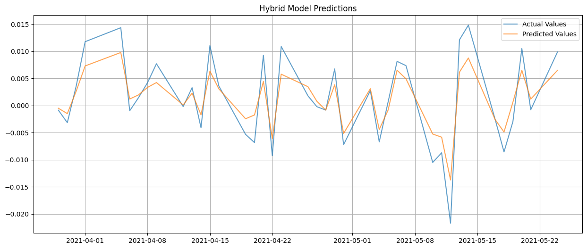
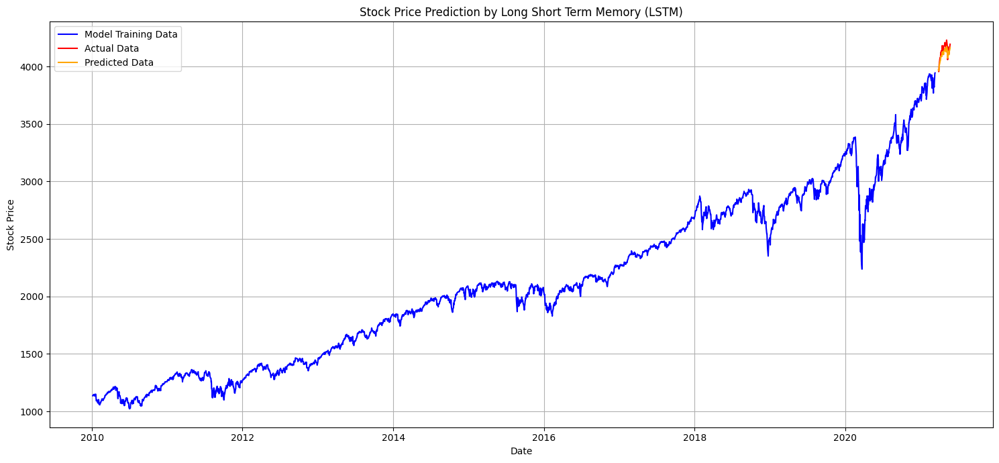

# S&P 500 Index Prediction Using a Hybrid ARFIMA-LSTM Model with Wavelet Decomposition


<p align="center">
  
</p>

<p align="justify">
Financial time series forecasting, particularly in stock markets, is a complex and challenging problem due to the nonlinear, non-stationary, and volatile nature of market data. These movements are often influenced by a multitude of economic, social, and political factors, making accurate predictions essential for investors, policymakers, and financial institutions. Traditional statistical models, such as ARIMA, while effective in capturing linear trends, often struggle to address the intricate dependencies and irregularities present in financial time series data.
</p>

<p align="justify">
To overcome these limitations, this study introduces a hybrid ARFIMA-LSTM model for predicting the log returns of the S&P 500 index. The proposed approach leverages the complementary strengths of statistical and machine learning methods to capture both short-term volatility and long-term dependencies in financial data. The methodology begins with the ARFIMA model, which captures long-memory behavior often observed in financial time series. The residuals from ARFIMA are then decomposed into approximation and detail components using Wavelet Transform. These components are modeled using LSTM networks, which are designed to handle sequential data with temporal dependencies. Finally, a Random Forest Regressor combines the predictions from the LSTM models to generate the final forecast.
</p>

<p align="justify">
The performance of the proposed model is evaluated using multiple metrics, including MSE, RMSE, MAE, R², MAPE, and directional accuracy. Results demonstrate the model’s ability to outperform traditional approaches, offering reliable predictions of both log returns and reconstructed stock prices.
</p>


## 📌 Overview

This project presents a **hybrid forecasting model** that combines **ARFIMA (AutoRegressive Fractionally Integrated Moving Average), LSTM (Long Short-Term Memory), and Wavelet Transform** to predict **S&P 500 stock price log returns**. 

- **📊 ARFIMA** captures long-term memory effects.
- **🔍 Wavelet Transform** extracts multi-resolution features.
- **🤖 LSTM** models sequential dependencies in price movements.
- **🌲 Random Forest Regressor** improves final prediction accuracy.

> 💡 This repository is built for **financial time series analysis**, bridging **statistical** and **deep learning** approaches for **robust stock market prediction**.

The final predictions are obtained using a **Random Forest Regressor**, which combines LSTM outputs for more accurate forecasting.

## 🚀 Methodology
### **1️⃣ Data Collection & Preprocessing**
- **Data Source:** S&P 500 daily closing prices from **Yahoo Finance**.
- **Log Returns Calculation:** \( R_t = \log (P_t / P_{t-1}) \) for variance stabilization.
- **Standardization:** Using mean and standard deviation normalization.

### **2️⃣ ARFIMA Modeling (Long-Term Trends)**
- Captures **long-memory properties** in financial data.
- Extracts **residual errors** for further analysis.

### **3️⃣ Wavelet Transform (Multi-Resolution Analysis)**
- Decomposes residuals into **approximation** and **detail components**.
- **Daubechies db4 wavelet function** is used.

### **4️⃣ LSTM Modeling (Short-Term Dependencies)**
- **One LSTM network** models the **approximation component** (long-term trends).
- **Multiple LSTM networks** model **detail components** (short-term variations).
- Uses **a sliding window approach** for sequential learning.

### **5️⃣ Random Forest Regression (Final Prediction)**
- Combines **LSTM predictions** for the final stock price index forecast.

## 📊 Performance Evaluation
The model is evaluated using the following metrics:
- **Mean Squared Error (MSE)**
- **Root Mean Squared Error (RMSE)**
- **Mean Absolute Error (MAE)**
- **R² Score**
- **Mean Absolute Percentage Error (MAPE)**
- **Directional Accuracy (%)**

### **🔹 Results for GSPC Index**  
| Metric                 | Hybrid (ARFIMA-LSTM) |
|------------------------|----------------------|
| **MSE**                | **0.00001**         |
| **RMSE**               | **0.00322**         |
| **MAE**                | **0.00268**         |
| **R² Score**           | **0.83357**         |
| **MAPE**               | **87.99**           |
| **Directional Accuracy** | **89.74%**         |

## 📊 An Example for GSPC Index Predictions
Below is the comparison between **Actual Values** and **Predicted Values** for the S&P 500 Index:

<p align="center">
  
</p>

---

## 📈 An Example for  GSPC Index Stock Price Prediction 
The figure below shows the **LSTM-based stock price prediction** for the S&P 500 Index.

<p align="center">
  
</p>


## 📂 Repository Structure
```plaintext
📦 HybridModel
 ┣ 📜 HybridModel_Wavelet.ipynb  # Jupyter Notebook with the full pipeline
 ┣ 📜 README.md                               
 
```
## 🛠️ Installation & Requirements
To run this project, install the required dependencies:

```bash
pip install numpy pandas matplotlib seaborn tensorflow keras scikit-learn pywt
```

🤝 Contributing
Feel free to fork this repository, submit pull requests, or open issues for improvements.


✉️ Author: Ahmet Kaçmaz
