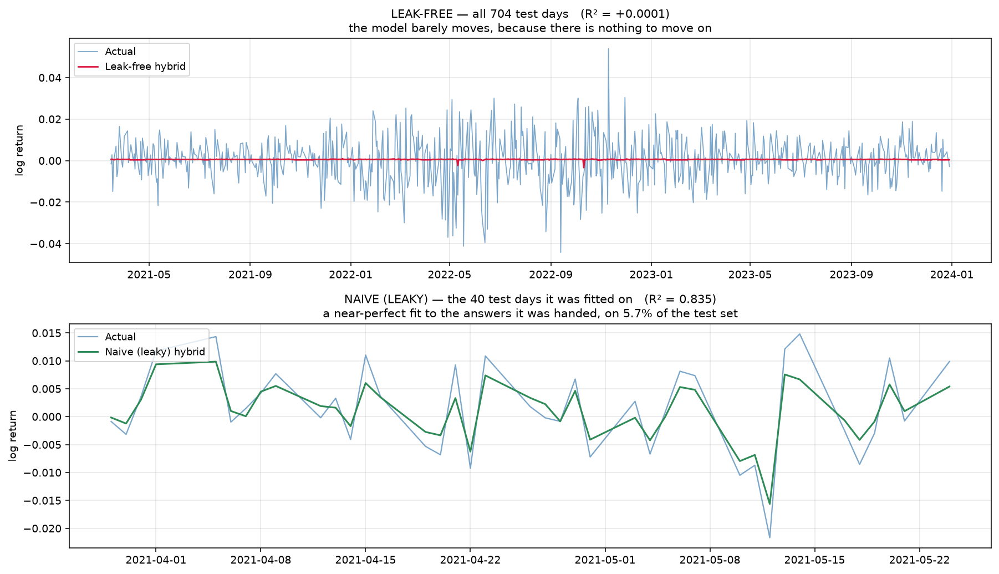

# Forecasting S&P 500 Volatility: A Leak-Free Multiscale Study

**Ahmet Kaçmaz**

A five-part study of volatility forecasting, built under one rule: **every claim has to survive an
attempt to break it.** It opens by demonstrating that a widely-used forecasting recipe is silently
leaking future information, and ends by showing that the biggest gain available comes not from a
better model but from better information.



---

## TL;DR

A recipe that appears throughout the applied forecasting literature — *decompose a series with a
wavelet transform, train one LSTM per component, combine them with a tree ensemble* — reports an
out-of-sample **R² of 0.83** on daily S&P 500 returns.

**That result is an artifact of data leakage, and I can prove it:** replace every LSTM output in the
pipeline with **pure random noise** and it still reports R² ≈ 0.82. The model contributes nothing to
its own headline number.

| | leaky pipeline | leak-free rebuild |
|---|---|---|
| R² on daily returns | **0.832** | **−0.0005** |
| directional accuracy | 97% | 50.6% |
| test days actually evaluated | 40 of 705 | **705 of 705** |
| reproducible with random noise | **yes** | no |
| distinguishable from forecasting zero | — | no (DM test, *p* = 0.27) |

**Daily returns are not predictable.** R² ≈ 0 is the correct answer, and any pipeline that finds a
lot should be assumed broken until proven otherwise.

But **volatility is** — and that is where this architecture always belonged. The fractional
differencing parameter is **d ≈ −0.13 for returns** and **d ≈ +0.58 for log realized volatility**:
long memory and multiscale structure are properties of volatility, not of returns.

| model (h = 1, S&P 500) | features | R² on log realized vol |
|---|---|---|
| HAR-RV (Corsi 2009 — the field standard) | 3 | 0.457 |
| HAR + leverage + jumps | 7 | 0.476 |
| **WaveHAR-LJ** — causal wavelet basis | 10 | **0.500** |
| **Implied volatility alone** (VIX suite) | 5 | **0.512** |
| HAR-LJ + implied volatility | 12 | 0.537 |
| **HAR + leverage + jumps + implied volatility + wavelet** | 15 | **0.542** |

And the finding that reframed the whole project: **adding implied volatility is worth +0.061 R²
(DM p < 0.0001) — more than the wavelet, the LSTM stack and the fitting-scheme grid combined.** A
five-feature linear regression on VIX alone is statistically indistinguishable from the entire
architecture built over four notebooks.

> When a model is stuck, the reflex is to reach for a bigger model. Almost always the binding
> constraint is **information**, not capacity. Ask what your model *cannot possibly know* — and go
> get that, before you make it deeper.

---

## The leak

```python
def combine_predictions(self, approx_pred, detail_preds, y_true):
    X = np.column_stack([approx_pred] + detail_preds)
    self.rf_model.fit(X, y_true)      # trains on the answer key…
    return self.rf_model.predict(X)   # …then "predicts" the same rows
```

`predict()` calls this with the **test set's own targets**. The model is shown the answers,
memorises them with a 100-tree forest, and hands them back as a forecast.

Three further defects compound it:

1. **Only 5.7% of the test set is ever evaluated.** `pywt.wavedec` downsamples; after a level-4
   decomposition and length-truncation, 705 test days become **40 predictions**.
2. **Inputs come from the target's future.** The wavelet *coefficient index* is treated as a *day
   index*. At level 4 each coefficient spans ~16 days, so the model is fed data from up to
   **735 days after** the day it is asked to predict.
3. **There is no ARFIMA in the "ARFIMA" model.** Point `auto_arima` at daily returns and it selects
   ARIMA(2,0,0) — `d = 0`. No fractional differencing happens anywhere. *Correctly so*: on returns
   there is no long memory to capture. That realisation is what redirected the study toward
   volatility.

This is not an isolated bug. Jiang, Wu & Chen (2024) document the same class of error across the
signal-decomposition forecasting literature, calling it *"an ingrained and universal error in time
series modeling."*

---

## Notebooks

### [`01_leakage_forensics.ipynb`](nb/01_leakage_forensics.ipynb)
- the **random-noise ablation** that proves the pipeline contributes nothing to its own result
- an empirical measurement of the wavelet transform's support, exposing the look-ahead
- a **leak-free rebuild**: causal wavelet features recomputed on trailing windows only, a stacker
  trained on out-of-fold predictions, the full test set — with a **causality unit test** that
  destroys the future and asserts the past does not move
- the honest result (R² ≈ 0) against zero-forecast, historical-mean, random-walk and AR(2)
  baselines, with a Diebold–Mariano test

### [`02_volatility_model.ipynb`](nb/02_volatility_model.ipynb)
- **why volatility**: d ≈ −0.13 for returns but **+0.58** for log realized volatility
- a **real ARFIMA** — the binomial expansion of $(1-L)^d$, verified to remove the long memory it
  targets (d → −0.07 after differencing)
- causal wavelet + LSTM + stacker against **HAR-RV, GARCH(1,1), EWMA** and a random walk, on RMSE,
  R² and QLIKE, averaged over **5 seeds**
- **finding: the deep-learning stack adds nothing** over a properly specified ARFIMA (DM p = 0.63).
  On a single lucky seed it would have looked like a win; averaging over five seeds is what caught it.

### [`03_multiscale_extensions.ipynb`](nb/03_multiscale_extensions.ipynb)
- the **causal Haar à trous transform** — shift-invariant, causal *by construction*, O(T·J), exact
  additive reconstruction; both properties unit-tested rather than asserted
- **WaveHAR**: six derived multiscale components vs HAR-RV's three hand-picked averages, same OLS
  estimator on both sides, plus a **flexibility-matched control** so a win cannot be bought with
  extra parameters
- multi-horizon forecasts (h = 1…22) with **HAC-corrected Diebold–Mariano** tests
- a **hand-rolled multi-step ARFIMA** validated against `statsmodels` to ~1e-16 before use
- six markets, one pipeline, nothing re-tuned; and one more (failed) attempt to make nonlinearity
  pay — a forest on the *same* multiscale features loses to OLS (p = 0.0001)

### [`04_stress_test.ipynb`](nb/04_stress_test.ipynb)
Attacks Notebook 3's own conclusion with the strongest benchmarks I can build:
- a **fitting-scheme grid** (expanding + rolling 500/1000/1500/2000 days × refit every 1/5/22 days),
  because Audrino & Chassot (2024), testing ML against HAR on **1,455 stocks**, showed that most
  "we beat HAR" results are beating a *carelessly fitted* HAR
- **the scheme is selected on a validation window inside the training period** — never on test
- **modern HAR extensions**: leverage and jump components, added to *both* representations
- **outcome: the h = 1 claim dies** (p 0.026 → 0.133). **The h = 22 claim survives** (p 0.004 →
  **0.002**) — exactly where multiscale theory predicts the gain should be. Reported as such.

### [`05_implied_volatility.ipynb`](nb/05_implied_volatility.ipynb)
Gives the model the one thing no amount of architecture can provide: **forward-looking information**.
- every model in Notebooks 1–4 shares a blind spot — **they all look backwards**. None of them can
  know that the Fed meets on Wednesday. **The options market can.**
- the **VIX suite**: implied vol, its 5-day mean, the **term-structure slope** (VIX3M − VIX, which
  *inverts* in a crisis), **VVIX**, and the **variance risk premium**
- fitting scheme **and Ridge penalty** selected per model *and per horizon* on validation — a
  prototype that fixed the window across horizons nearly produced the false conclusion "implied vol
  hurts at long horizons"; it does not, the window was simply too short for overlapping monthly targets
- **+0.061 R² (p < 0.0001)**, and the wavelet's contribution is no longer detectable once implied
  volatility is in the model — in 0 of 3 markets
- **a correction to Notebook 2**: the Sharpe improvement from volatility targeting is re-tested with
  a paired block bootstrap and found **not statistically supported** (the standard error on a Sharpe
  ratio over 2.8 years is ≈ 0.6). Withdrawn.

---

## Method: what "leak-free" means here

- **Nothing is `.fit()` inside `predict()`.** Ever.
- **No feature for day *t* may touch data from day *t+1* or later.** The wavelet decomposition is
  recomputed causally rather than applied once to the whole series — and this is *tested*, not
  asserted: corrupt every future observation, recompute, check that no past feature moves by more
  than 1e-10.
- **Stackers train on out-of-fold predictions**; the same fold models produce the test features, so
  the stacker never meets a feature distribution it did not train on.
- **Every scaler, model parameter, fitting scheme, regularisation penalty and calibration constant
  is fitted on the training period only.**
- **The full test set is scored**, and every model is compared on identical days.
- **Baselines strong enough to lose to**, and HAC-corrected Diebold–Mariano tests to say whether a
  margin is real.
- **Stochastic results are averaged over 5 seeds.**
- **The notebooks print their conclusions from the computed results**, not from numbers typed into
  the markdown — so the prose cannot quietly drift from the evidence.

All five notebooks execute top-to-bottom with **zero errors** (`nbconvert --execute`, no
`--allow-errors`).

---

## Reproducing

```bash
pip install -r requirements.txt
python scripts/fetch_data.py          # caches data/*.csv (6 indices; skips files already present)
jupyter lab nb/                       # all five notebooks run top-to-bottom
```

Notebooks 1–2 train LSTMs and take ~20–30 minutes each on CPU (no GPU required — the best model in
this study is a linear regression). Notebooks 3–5 are linear and run in minutes. Data is cached to
CSV rather than fetched inline, because `yfinance` now returns MultiIndex columns and silently breaks
notebooks that index `df['Close']`.

---

## What I would not claim

**The volatility proxy is range-based, not high-frequency.** The literature's standard target is
realized variance from **5-minute intraday returns** (Liu, Patton & Sheppard, 2015). I use the
**Garman–Klass** estimator from daily OHLC bars, because intraday data for six indices over fourteen
years is not freely available. Range-based estimators are legitimate but **noisier**, and a noisier
target compresses the differences between good models. **This is the largest gap between this study
and the published literature, and it is not closed here.**

For the same reason the leverage and jump components are **daily-data analogues**, not the canonical
HAR-J / SHAR / HARQ specifications, which require bipower variation, signed semivariances and
realized quarticity.

Beyond that: six indices, one asset class, one out-of-sample window per market. The margins inside
the long-memory family are small and often not statistically significant — the notebooks say which,
next to each number. The claim is **not** "WaveHAR dominates." It is that a derived multiscale basis
is a defensible peer of the field-standard hand-crafted one, with a significant advantage at the
monthly horizon where its theory predicts one, and none at the daily horizon once the benchmark is
fitted properly — and that **the largest available gain comes from information, not architecture.**

---

## References

- Corsi, F. (2009). *A Simple Approximate Long-Memory Model of Realized Volatility.* Journal of Financial Econometrics.
- Andersen, T., Bollerslev, T., Diebold, F., Labys, P. (2003). *Modeling and Forecasting Realized Volatility.* Econometrica.
- Renaud, O., Starck, J.-L., Murtagh, F. (2005). *Wavelet-Based Combined Signal Filtering and Prediction.* IEEE Trans. SMC-B.
- Audrino, F., Chassot, J. (2024). *HARd to Beat: The Overlooked Impact of Rolling Windows in the Era of Machine Learning.* — the critique Notebook 4 answers.
- Jiang, K., Wu, C., Chen, Y. (2024). *Revisiting the Efficacy of Signal Decomposition in AI-based Time Series Prediction.* — documents the leak in Notebook 1 as a field-wide error.
- Clements, A., Perera, A. (2026). *Enhancing Volatility Prediction: A Wavelet-Based Hierarchical Forecast Reconciliation Approach.* Journal of Forecasting.
- Liu, L. Y., Patton, A., Sheppard, K. (2015). *Does Anything Beat 5-Minute RV?* Journal of Econometrics.
- Geweke, J., Porter-Hudak, S. (1983). *The Estimation and Application of Long Memory Time Series Models.*
- Patton, A. (2011). *Volatility Forecast Comparison using Imperfect Volatility Proxies.* Journal of Econometrics.
- Diebold, F., Mariano, R. (1995). *Comparing Predictive Accuracy.* Journal of Business & Economic Statistics.
- Harvey, D., Leybourne, S., Newbold, P. (1997). *Testing the Equality of Prediction Mean Squared Errors.* Int. J. Forecasting.
- Garman, M., Klass, M. (1980). *On the Estimation of Security Price Volatilities from Historical Data.*
- Bollerslev, T., Patton, A., Quaedvlieg, R. (2016). *Exploiting the Errors: A Simple Approach for Improved Volatility Forecasting.* Journal of Econometrics.

## License

MIT
